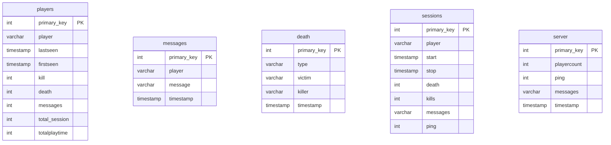
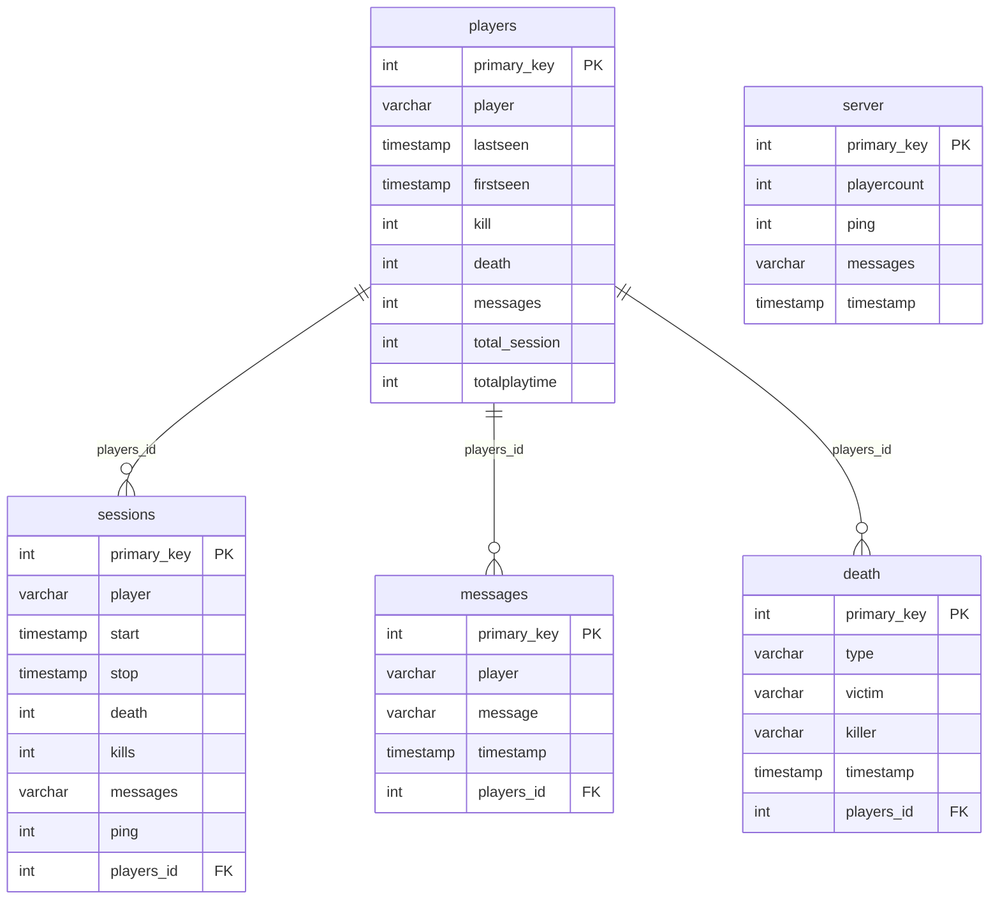

## 1 Introduction du projet
Ce projet a pour objectif de créer des graphes à l’aide de DB d’un serveur minecraft, ce projet pourrait accepter des DB d’autres serveur minecraft si elles respectent une certaine architecture. 
Nous avons choisi de faire ce projet car nous employons les requêtes SQL vu en cours, des données pourront etres rajoutés grâce au requête SQL, le but principal est de pouvoir réussir à transformer ces données en graphes et d’avoir un code fonctionnel. 
(prépa à Faidherbe ou Colbert MP2I svp les frérots)


(seul texte rédiger par dylan bravo a lui)


## 2 Conception du projet
#### Architecture
arborecance:
```text
projet_nsi/
│
├── 3b3france_dump.psql           # dump de la base PostgreSQL
├── start.py                      # lance postgres + restore dump + connection
├── query.py                      # les query sous form de fonction pour faire redecendre les parametres
├── analyse.py                    # execute des requêtes et return des datafram ou des int 
├── ui.py                         # interface graphique
├── main.py                       # point d’entrée du projet
│
└── README.md
```

#### DB



possible relation a ajouter:


## 3 Documentation utilisateur
run main.py

## 4 carnet de bord
```text
[ Séance 1 ]
• trouver une idée de projet

--------------------------------------
 
entre les séances : 
• 15 → SBN m’a envoyé sa base de données

--------------------------------------

[ Séance 2 ]
• pas de projet (révisons bac)

--------------------------------------

[ Séance 3 ]

--------------------------------------

[ Séance 4 ]
• try de lancer la db et exécuter des requêtes
• problèmes de configuration

--------------------------------------

entre les séances :
→ La DB tourne enfin avec Docker
→ mise en place de l’architecture du projet
→ première requête qui marche enfin
→ nouvelle requête de base et de test
→ début du README
→ diagramme Mermaid

--------------------------------------

[ séance 5 ]
• finalisation du "backend"
• nettoyage et organisation des requêtes

----- restitution intermédiaire ------

ambitions pour les 2 dernières semaines :
• ui complète avec Tkinter (≈ 1 semaine)
• ajuster/modifier les requêtes si nécessaire
• trouver des idée de graphique plus complexe 
• si temps restant :
   → dashboard avec grafana (a voir comment ça marche)
   → recup d'autre db sur d'autre serv avec le bot de sbn
   
--------------------------------------   
```

## 5 Conclusion

## 6 Bibliographie
```text
RÉFÉRENCES & RESSOURCES

[ SQL ]
• sous-requêtes       → https://sql.sh/cours/sous-requete
• operation math      → https://sql.sh/fonctions/mathematiques
• alias               → https://sql.sh/cours/alias

[ MARKDOWN ]
• syntaxe de base     → https://www.markdownguide.org/basic-syntax/

[ LIBRAIRIES / OUTILS ]
• vidéo python ui     → https://www.youtube.com/watch?v=8exB6Ly3nx0
• pandas – guide      → https://pandas.pydata.org/docs/user_guide/index.html
```