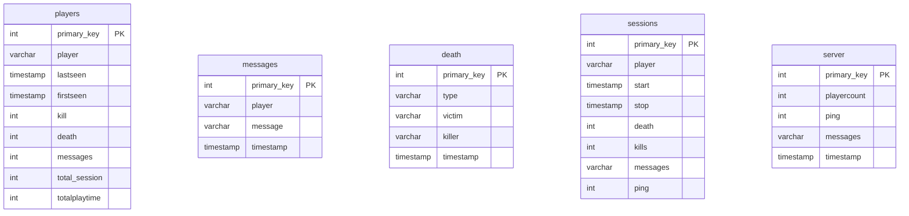
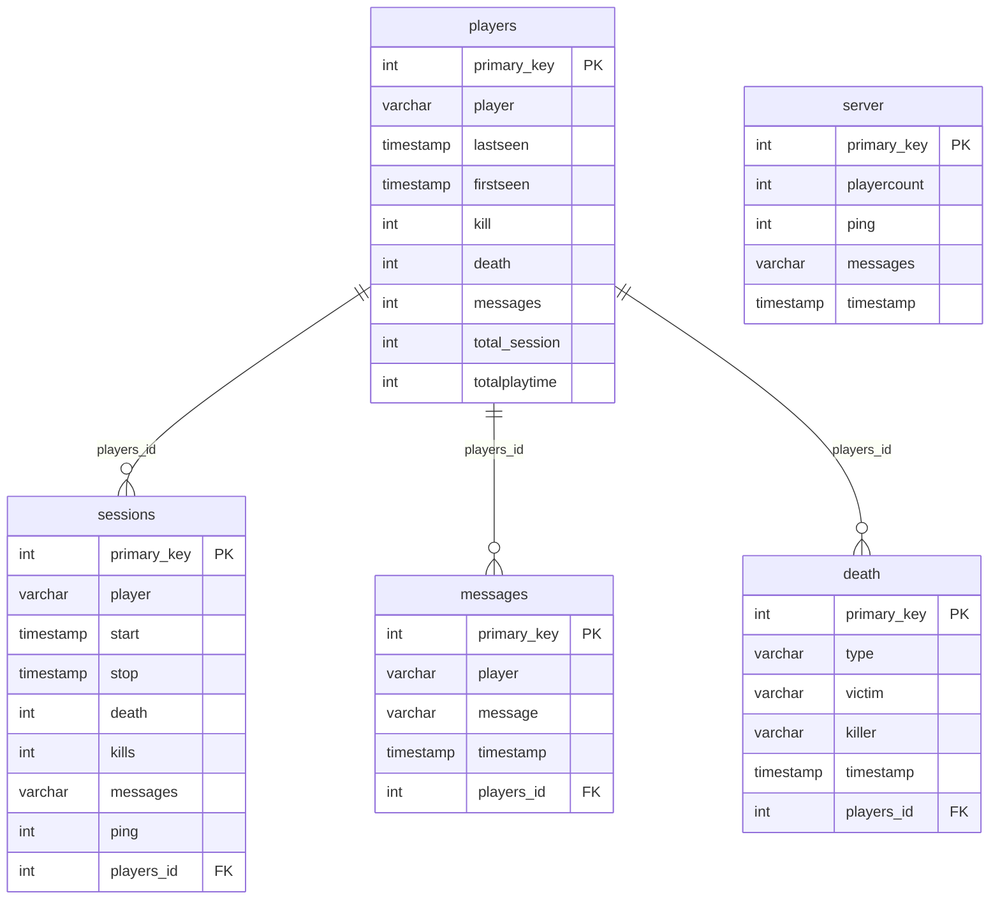
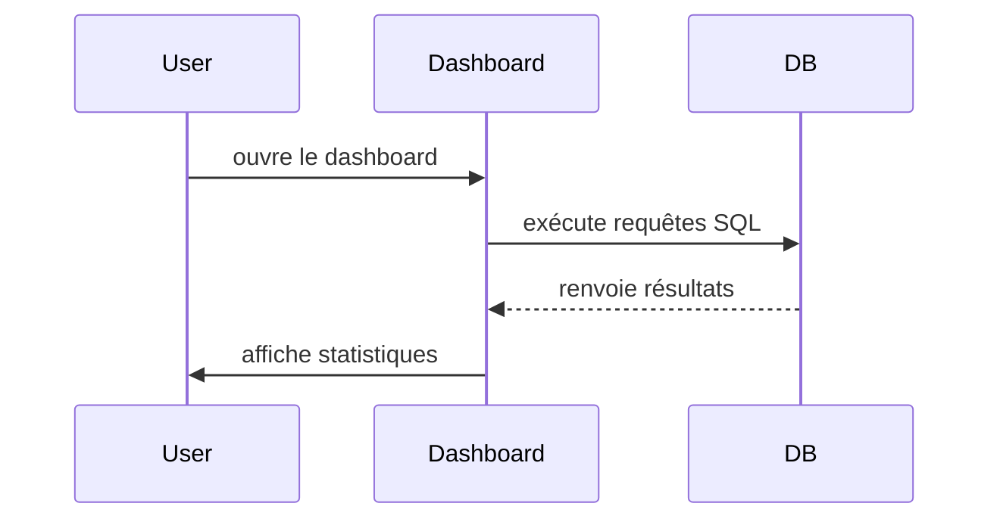

## 1 Introduction du projet
Ce projet a pour objectif de créer un dashboard interactif permettant de monitorer des statistiques d’un serveur Minecraft.  
Le projet utilise une base de données PostgreSQL fournie et permet d’analyser différents aspects du serveur : nombre de joueurs, messages, événements et types de morts.  


<!-- Ce projet a pour objectif de créer des graphes à l’aide de DB d’un serveur minecraft, ce projet pourrait accepter des DB d’autres serveur minecraft si elles respectent une certaine architecture. 
Nous avons choisi de faire ce projet car nous employons les requêtes SQL vu en cours, des données pourront etres rajoutés grâce au requête SQL, le but principal est de pouvoir réussir à transformer ces données en graphes et d’avoir un code fonctionnel. 
(prépa à Faidherbe ou Colbert MP2I svp les frérots)

(seul texte rédiger par dylan bravo a lui)-->

## 2 Conception du projet
#### Architecture
```text
arborescence

projet_nsi/
│
├── requirements.txt              //dépendance
├── .gitignore                    //
│
├── database/
│    └──3b3france_dump.psql        // dump de la base PostgreSQL
│
├── backend/
│    ├──__init__.py               // magie obscure pour faire de backend/ un package
│    ├──start.py                  // lance postgres + restore dump + connection
│    ├──query.py                  // les query sous form de fonction pour faire redecendre les parametres
│    └──analyse.py                // execute des requêtes et return des datafram ou des int 
│
├── dashboard.py                  // interface web
├── main.py                       // point d’entrée du projet
│
└── README.md                     // this files
```

#### choix des techno

• librairi psycopg2 comme sqlite3 mais pour postgresql  
• librairi pandas pour la manipulation de data  
• framework streamlit pour l'interface web car beaucoup plus simple et rapide à mettre en place que flask (pas de templates ect)  <!-- je suis pas huseyin -->

#### DB



possible relation à ajouter:


## 3 Documentation utilisateur

#### prérequis
python 3.12  
docker


#### instalation et exécution
1. cloner le repo  
```git clone https://github.com/rom640/MCdashboard```  
```cd projet_nsi```
2. créer le venv  
```python3 -m venv .venv```
3. activer le venv  
```source .venv/bin/activate```
4. installer les dépendances  
```pip install -r requirements.txt``` 
5. lancer le projet  
```streamlit run dashboard.py```


## 4 carnet de bord
```text
[ Séance 1 ]
• trouver une idée de projet qui devra utiliser une database sql

--------------------------------------
 
entre les séances : 
• idée de monitor pour serveur minecraft
• une amie me send sa base de données d'un serveur minecraft 

--------------------------------------

[ Séance 2 ]
• pas de projet (révisions bac)

--------------------------------------

[ Séance 3 ]
• recherche de techno pour le projet

--------------------------------------<

[ Séance 4 ]
• try de lancer la db et exécuter des requêtes
• problèmes de configuration (de ports)

--------------------------------------

entre les séances :
→ La DB run avec Docker
→ mise en place de l’architecture du projet
→ première requête fonctionnelle enfin
→ créeation de plusieurs requêtes de base et de test
→ début du README
→ diagramme Mermaid

--------------------------------------

[ Séance 5 ]
• finalisation du "backend"
• nettoyage et organisation des requêtes

----- restitution intermédiaire ------

ambitions pour les 2 dernières semaines :
• ui complète avec Tkinter ou autre (≈ 1 semaine)
• ajuster/modifier les requêtes si nécessaire
• trouver des idées de donnée plus complexe a visualiser 
• si temps restant :
   → dashboard avec grafana (à voir comment ça marche)
   → récup d'autres db sur d'autre serv avec le bot de sbn
   
--------------------------------------   

entre les séances :
→ amélioration du README
→ ui complete avec streamlit (pour les query actuel)
→ récup le code du bot de sbn 

--------------------------------------   

[ séance 6 ]
• recherche de dernière idées
• finalisation du "frontend"
• le projet est déjà prêt à être rendu en soi

ambitions pour la derniere semaines/vacance :
• terminer le projet
• aprendre comment marche la virtualisation (et/ou plein d'autre truc) 
pour héberger le bot et le projet pour utiliser le dashboard en temps réel 
 
--------------------------------------   
 
 entre les séances :
→ completion du README
→ ui complète avec streamlit (pour les query actuelles)
→ recup le code du bot de sbn 
→ nouvelle page pour info sur les player spécifique
→ créeation du repo github

-------------------------------------- 


kill streak
Ratio Kill / Death
candle chart des nouveau par jours
nouvelle page pour d'autre info comme parametre du bot
joueur co actuelement et chat (dynamique)

--------------------------------------   
```

## 5 Conclusion
Ce premier projet m’a appris beaucoup de choses, notamment toute la partie autour du développement : utilisation d’un IDE, gestion d’un environnement virtuel, organisation d’un dépôt github et travail avec docker.

J’ai également découvert la partie conception d’un projet, comme le choix des bibliothèques spécifique, l'architecture.

J’ai rencontré plusieurs difficultés, surtout au niveau de la configuration docker.

Pour l’instant le dashboard est conçu avec une db static d'un moment precis, mais avec plus de temps j’aimerais rendre le projet dynamique et l’héberger pour qu’il puisse fonctionner en temps réel.

## 6 Bibliographie
Le développement du projet s’est appuyé sur plusieurs documentations techniques et supports pédagogiques listés ci-dessous.  <!-- bien corpo comme ça -->

#### SQL
• [sous-requêtes](https://sql.sh/cours/sous-requete)  
• [opérations mathématiques](https://sql.sh/fonctions/mathematiques)  
• [alias](https://sql.sh/cours/alias) // de base pour la documentation mais enlever pour les dataframe  
• [group by](https://sql.sh/cours/group-by)  

#### Markdown
• [syntaxe de base](https://www.markdownguide.org/basic-syntax/)   
• [mermaid](https://mermaid.js.org/)  

#### Librairies et outils python
• [psycopg2](https://www.psycopg.org/docs/)  
• [pandas](https://pandas.pydata.org/docs/user_guide/index.html)  
• [guide pandas et dataframe](https://www.youtube.com/watch?v=zZkNOdBWgFQ)  
• [ui python avec Matplotlib et Tkinter ](https://www.youtube.com/watch?v=8exB6Ly3nx0) // initialement avant l'interface web  
• [streamlit](https://docs.streamlit.io/get-started/fundamentals/advanced-concepts)  
• [venv](https://docs.python.org/fr/3/tutorial/venv.html)  
• [import](https://docs.python.org/fr/3/reference/import.html)  
• [*args and **kwargs](https://www.w3schools.com/python/python_args_kwargs.asp)  
• [idently](https://www.youtube.com/@Indently)  
• [graven](https://www.youtube.com/@Gravenilvectuto)  
• [petit video](https://www.youtube.com/watch?v=nLRL_NcnK-4)

#### Magnifique et fabuleux cours
• [explication du projet](https://nsiterminalefremeaux.notion.site/Projet-Explication-2dfbfb273310800eba49dffda8c7b548)  
• [attendu du projet](https://nsiterminalefremeaux.notion.site/Aide-et-attendu-projet-BDD-2e0bfb2733108070af83e14866c54c33)  
• [sql](https://nsiterminalefremeaux.notion.site/Manipuler-des-bases-de-donn-es-avec-le-langage-SQL-2c0bfb27331080238d3bed473ac6f775)  
• mention spéciale à la récursivité et la OOP seul cours utils de l'année  

#### Miscellaneous
• [palette de couleur](https://htmlcolorcodes.com/fr/)  
• [inspiration](https://grafana.falling-from.space/public-dashboards/7ac85671fc054b158c995589cd2b577c)
• [bot de sbn](https://codeberg.org/FRAnarchyDev/3b3bot)  
• [utile en ces temps dure](https://downloadmoreram.com/)  


