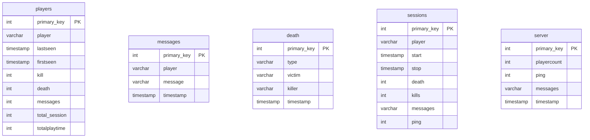
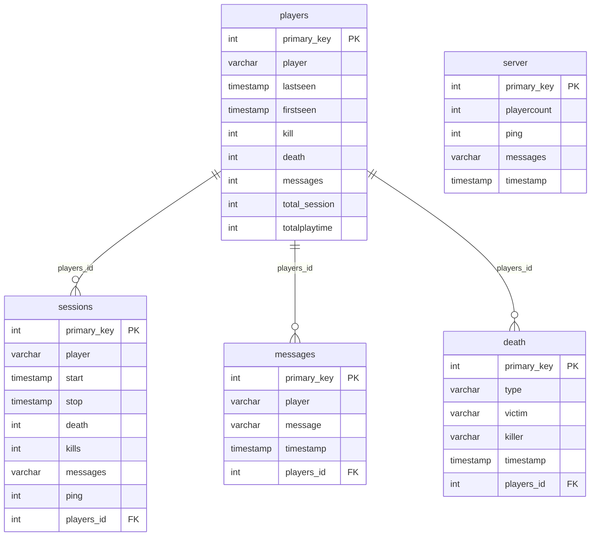

## 1 Introduction du projet
Ce projet a pour objectif de créer des graphes à l’aide de DB d’un serveur minecraft, ce projet pourrait accepter des DB d’autres serveur minecraft si elles respectent une certaine architecture. 
Nous avons choisi de faire ce projet car nous employons les requêtes SQL vu en cours, des données pourront etres rajoutés grâce au requête SQL, le but principal est de pouvoir réussir à transformer ces données en graphes et d’avoir un code fonctionnel. 
(prépa à Faidherbe ou Colbert MP2I svp les frérots)


(seul texte rédiger par dylan bravo a lui)


## 2 Conception du projet
#### Architecture
arborecance:
```text
projet_nsi/
│
├── requirements.txt              //dépendance
├── .gitignore                    //
│
├── database/
│   └──3b3france_dump.psql        // dump de la base PostgreSQL
│
├── backend/
│    ├──__init__.py               // magie obscure pour faire de backend/ un package
│    ├──start.py                  // lance postgres + restore dump + connection
│    ├──query.py                  // les query sous form de fonction pour faire redecendre les parametres
│    └──analyse.py                // execute des requêtes et return des datafram ou des int 
│
├── dashboard.py                  // interface web
├── main.py                       // point d’entrée du projet
│
└── README.md                     // this files
```

#### DB



possible relation à ajouter:


## 3 Documentation utilisateur

python3 -m venv .venv
source .venv/bin/activate
pip install -r requirements.txt
streamlit run dashboard.py
http://localhost:8502/

## 4 carnet de bord
```text
[ Séance 1 ]
• trouver une idée de projet

--------------------------------------
 
entre les séances : 
• 15 → SBN m’a envoyé sa base de données

--------------------------------------

[ Séance 2 ]
• pas de projet (révisons bac)

--------------------------------------

[ Séance 3 ]

--------------------------------------<

[ Séance 4 ]
• try de lancer la db et exécuter des requêtes
• problèmes de configuration

--------------------------------------

entre les séances :
→ La DB tourne enfin avec Docker
→ mise en place de l’architecture du projet
→ première requête qui marche enfin
→ nouvelle requête de base et de test
→ début du README
→ diagramme Mermaid

--------------------------------------

[ séance 5 ]
• finalisation du "backend"
• nettoyage et organisation des requêtes

----- restitution intermédiaire ------

ambitions pour les 2 dernières semaines :
• ui complète avec Tkinter ou autre (≈ 1 semaine)
• ajuster/modifier les requêtes si nécessaire
• trouver des idée de graphique plus complexe 
• si temps restant :
   → dashboard avec grafana (a voir comment ça marche)
   → recup d'autre db sur d'autre serv avec le bot de sbn
   
--------------------------------------   

entre les séances :
→ amélioration de README
→ ui complete avec streamlit (pour les query de actuel)
→ recup le code du bot de sbn 

--------------------------------------   

[ séance 6 ]
• integration des dernier idée
• finalisation du "frontend"
• le projet est déjà prêt à rendre

ambitions pour la derniere semaines/vacance :
• utiliser le bot
• heberger le bot et le code pour utiliser le dashboard en temps réel 


kill streak
Ratio Kill / Death
candle chart des nouveau par jours
nouvelle page pour d'autre info comme parametre du bot
joueur co actuelement et chat (dynamique)
--------------------------------------   
```

## 5 Conclusion
j'ai apris des truc

## 6 Bibliographie
```text
[ SQL ]
• sous-requêtes           → https://sql.sh/cours/sous-requete
• operation math          → https://sql.sh/fonctions/mathematiques
• alias                   → https://sql.sh/cours/alias                                 // de base pour la documentation mais enlever pour les dataframe
• group by                → https://sql.sh/cours/group-by

[ MARKDOWN ]
• syntaxe de base         → https://www.markdownguide.org/basic-syntax/
• mermaid

[ LIBRAIRIES / OUTILS ]
• vidéo python ui         → https://www.youtube.com/watch?v=8exB6Ly3nx0
• pandas – guide          → https://pandas.pydata.org/docs/user_guide/index.html
• Streamlit               → https://docs.streamlit.io/get-started/fundamentals/advanced-concepts
• pandas et dataframe     → https://www.youtube.com/watch?v=zZkNOdBWgFQ
• Matplotlib et Tkinter   → https://www.youtube.com/watch?v=8exB6Ly3nx0
• venv                    → https://docs.python.org/fr/3/tutorial/venv.html
• import                  → https://docs.python.org/fr/3/reference/import.html
• petit video             → https://www.youtube.com/watch?v=nLRL_NcnK-4

[ MISC ]
• palette                 → https://htmlcolorcodes.com/fr/

[ Mangifique et fabuleux cours]
• explication du projet   → https://nsiterminalefremeaux.notion.site/Projet-Explication-2dfbfb273310800eba49dffda8c7b548
• attendu du projet       → https://nsiterminalefremeaux.notion.site/Aide-et-attendu-projet-BDD-2e0bfb2733108070af83e14866c54c33
• sql                     → https://nsiterminalefremeaux.notion.site/Manipuler-des-bases-de-donn-es-avec-le-langage-SQL-2c0bfb27331080238d3bed473ac6f775
• mention spéciaux a la récursivité et la OOP seul cours utils de l'année
```

## 7 crédit
```text
par odre d'utilité:

-rom         pour le code
-chat gpt    pour des idées
-huseyin     pour être present
-dylan
```